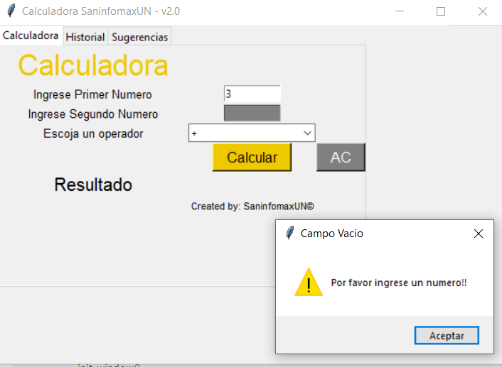
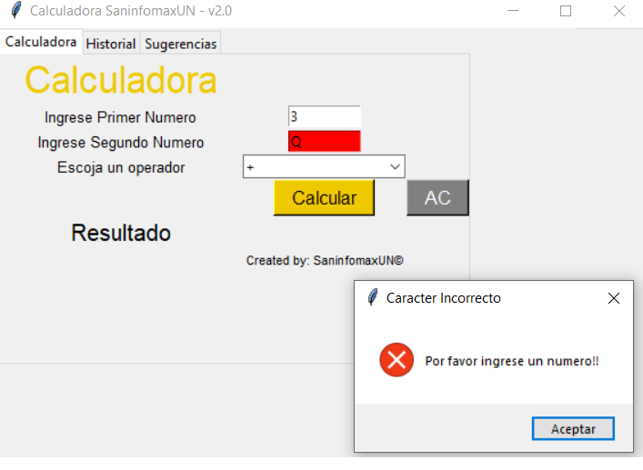
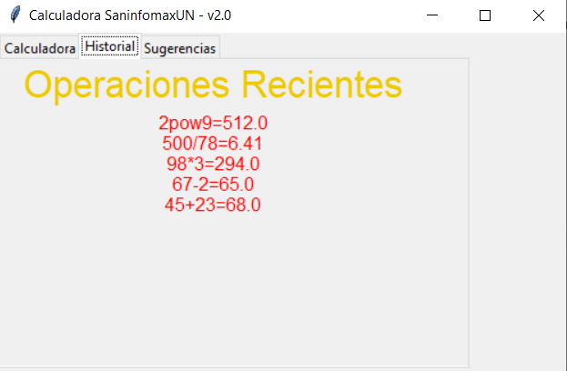
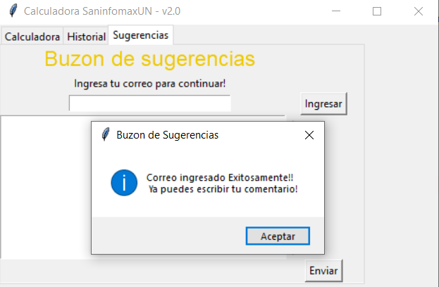
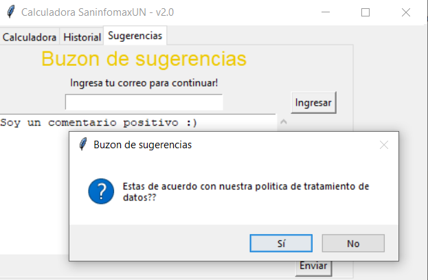
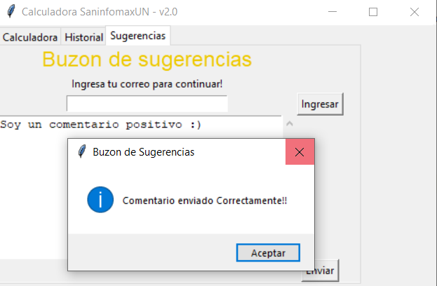
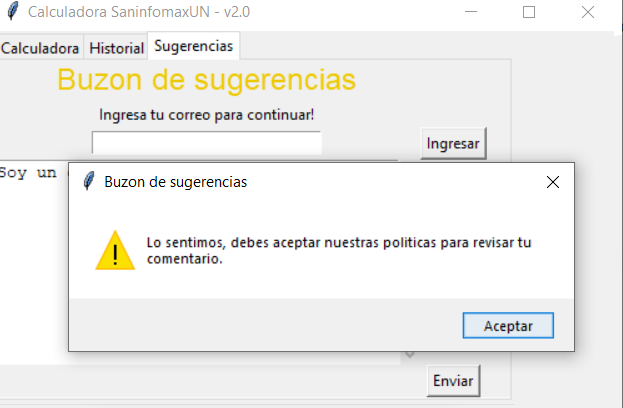

------------------------SaninfomaxUN-----------------------
# David Santiago Cruz Hernandez - G9 

Calculadora v2.0

Funcionalidades:

1. Deteccion de campos vacios: Emite una alerta y resalta el campo donde esta ocurriendo el hecho.

    

2. Deteccion de caracteres no numericos: Emite una alerta y resalta el campo donde esta ocurriendo el hecho. Le solicita al usuario ingresar un valor numerico.

    

3. Historial: Se mostraran las ultimas operaciones que el usuario realizo.

    

4. Buzon de comentarios: Un buzon que incluye las siguientes funcionalidades:
     
     
   - El  cuadro de texto esta bloqueado hasta que la persona ingrese su email.
      

        
      

     
     
   - Aviso sobre la politica de datos.
      

        
      

       
       
   - Si acepta, se mostrara un aviso informando que los datos fueron enviados correctamente.
      

        
      

         
        
   - Si los rechaza, se mostrara un aviso informando que es obligatorio aceptar la polica de tratamiento de datos..
      

        
      

      
      
       
       
   - Otras Funcionalidades:
    -Boton de resetear y limpiar los campos de la calculadora.
    
    
   **By SaninfomaxUN**
